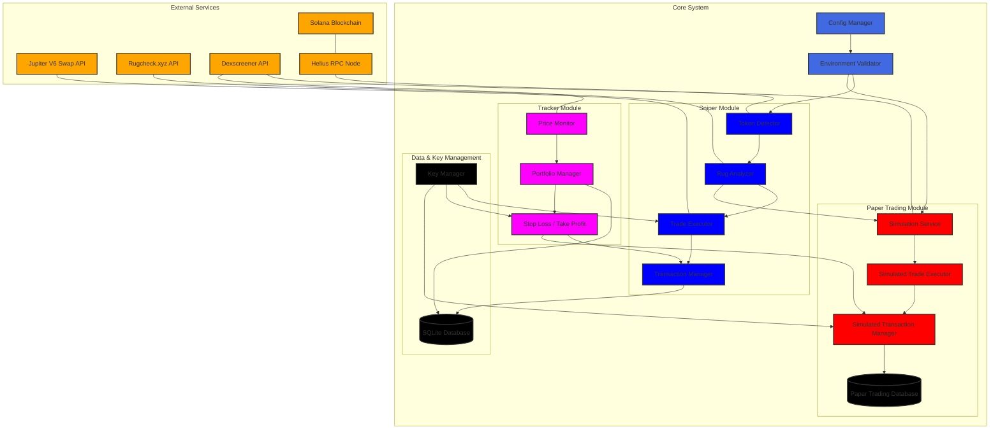

# Architecture Diagram - Solana Token Sniper

This diagram visualizes the system's architecture including both the real trading flow and the dedicated Paper Trading Module that enables the simulation mode.

### Explanation

1. **Configuration & Validation:**  
   The system starts with the Config Manager and Environment Validator, which load configuration settings (including the paper trading toggle).

2. **Real Trading Flow (Sniper Module):**  
   The Sniper Module manages token detection, analysis, real trade execution, and transaction management with data stored in the main SQLite database.

3. **Paper Trading Module:**
   When paper trading mode is enabled (`rug_check.simulation_mode`), tokens that pass the rug check are routed to the Simulation Service. The service fetches real-time price data from Dexscreener API and executes virtual trades. Simulated trades are processed by the Simulated Trade Executor and Simulated Transaction Manager, with results recorded in a dedicated Paper Trading Database (`src/tracker/paper_trading.db`). The module maintains a virtual balance and tracks token positions using real market prices.

4. **Tracker Module & Data Layer:**  
   Both real and simulated trades feed into the Tracker Module for portfolio tracking, and share common data and key management functionalities.

5. **External Integrations:**  
   The system interacts with external services (Solana, Jupiter API, RugCheck, Dexscreener, RPC) to fetch real-time data relevant to trading decisions.

Colors Used:
- External Services: Hot Pink (#FF69B4)
- Core Components: Royal Blue (#4169E1)
- Trading Components: Lime Green (#32CD32)
- Simulation Components: Gold (#FFD700)
- Tracker Components: Pale Green (#98FB98)
- Data Components: Dark Gray (#A9A9A9)