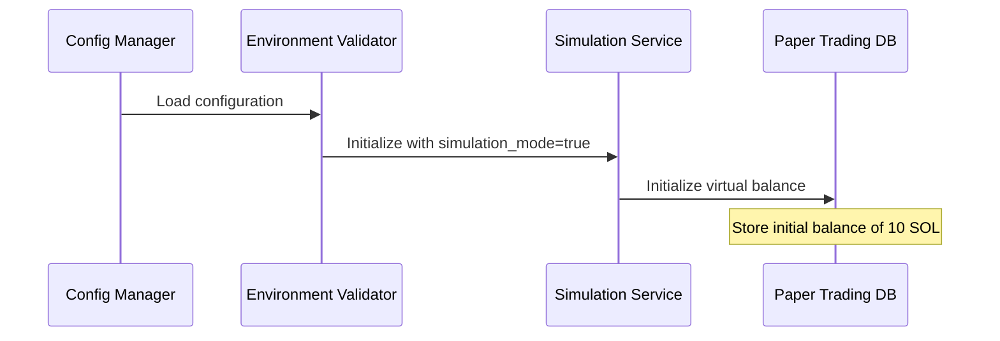
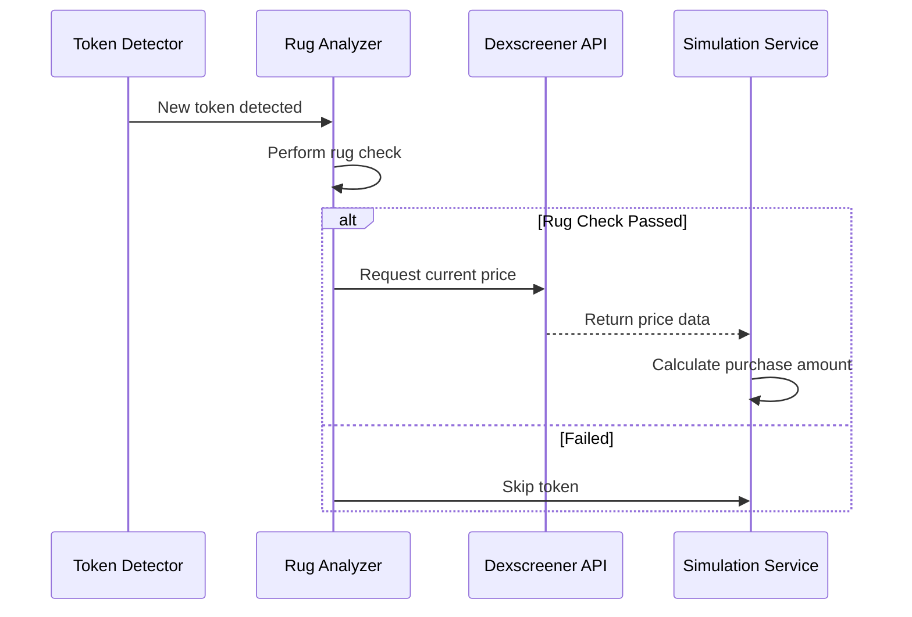
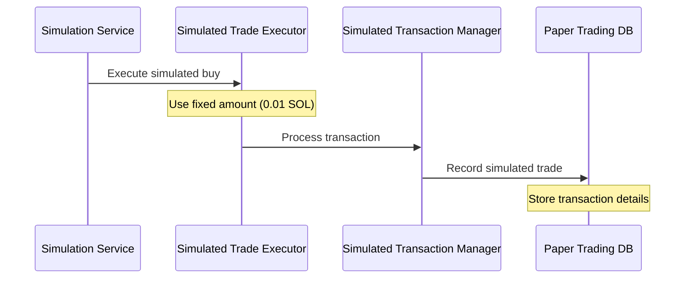

# Paper Trading Flow - Solana Token Sniper

## Overview
This document details the step-by-step flow of paper trading operations in the Solana Token Sniper system. Paper trading mode allows users to simulate trades using real market prices without actual token purchases.

## Flow Sequence

### 1. Initialization


### 2. Token Detection & Analysis Flow


### 3. Trade Execution Flow


## Detailed Process Steps

1. **Configuration Loading**
   - System reads `config.ts`
   - Checks `rug_check.simulation_mode` flag
   - Initializes virtual balance

2. **Token Detection & Analysis**
   - Token Detector identifies new token
   - Rug Analyzer performs standard checks
   - If token passes rug check:
     * Fetch real-time price from Dexscreener API
     * Format: `https://api.dexscreener.com/tokens/v1/{chainId}/{tokenAddresses}`

3. **Trade Decision**
   - If token passes rug check:
     * Use fixed amount from config: `"10000000"` (0.01 SOL)
     * Calculate trade using current market price
     * Apply configured slippage (2%)

4. **Simulated Transaction Processing**
   - Calculate fees based on configuration:
     ```typescript
     {
       prio_fee_max_lamports: 1000000,    // 0.001 SOL
       prio_level: "medium",              // or "veryHigh" (50000000, 0.05 SOL)
       slippageBps: "200"                 // 2% slippage
     }
     ```

5. **Database Recording**
   - Store in `src/tracker/paper_trading.db`:
     * Transaction details
     * Virtual balance updates
     * Token holdings
     * Fees deducted

6. **Portfolio Tracking**
   - Monitor token price changes
   - Calculate PNL
   - Execute stop-loss/take-profit if configured:
     ```typescript
     {
       price_source: "dex",               // dex=Dexscreener, jup=Jupiter
       prio_fee_max_lamports: 1000000,    // 0.001 SOL
       prio_level: "medium",              // medium or veryHigh
       slippageBps: "200"                 // 2% slippage
     }
     ```

## Key Components

1. **Simulation Service**
   - Manages virtual balance
   - Coordinates with price feeds
   - Calculates transaction costs

2. **Simulated Trade Executor**
   - Processes buy/sell decisions
   - Applies slippage calculations
   - Handles fee deductions

3. **Simulated Transaction Manager**
   - Records all simulated trades
   - Manages paper trading database
   - Tracks portfolio performance

4. **Paper Trading Database**
   - Location: `src/tracker/paper_trading.db`
   - Stores all simulated transactions
   - Maintains virtual balance records
   - Tracks simulated portfolio

## Integration Points

1. **External Price Data**
   - Primary: Dexscreener API
   - Backup: Jupiter API
   - Used for real-time price simulation

2. **Existing Systems**
   - Uses same rug check logic
   - Shares monitoring systems
   - Utilizes existing token detection

3. **Configuration**
   - Toggle: `rug_check.simulation_mode`
   - Logging: `rug_check.verbose_log`
   - Uses existing fee structures

This flow ensures that paper trading closely mimics real trading behavior while maintaining separate data storage and preventing any real transactions from occurring.