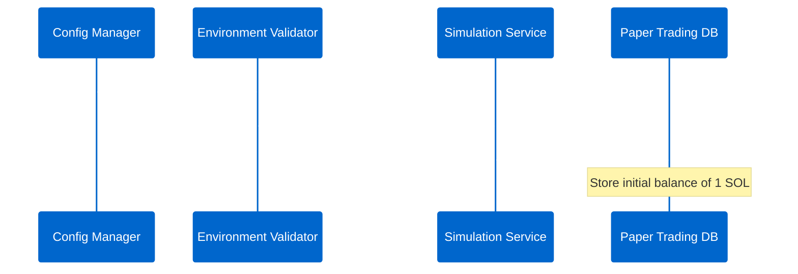
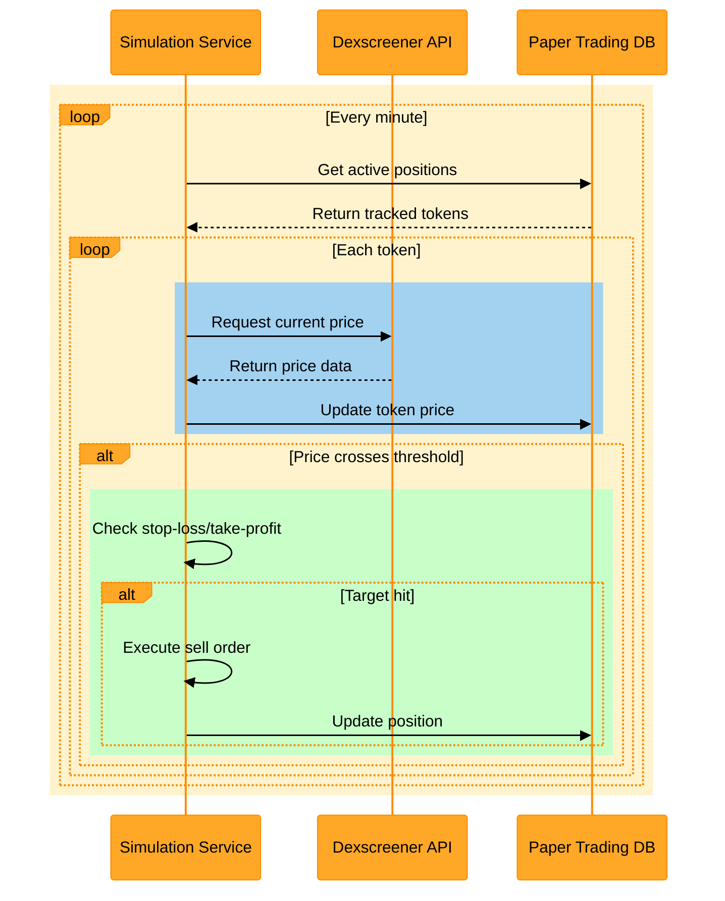
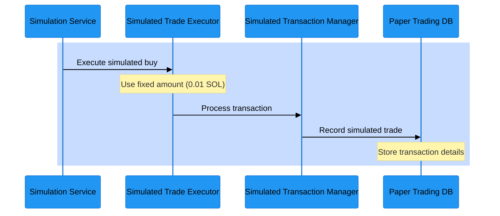

# Paper Trading Flow - Solana Token Sniper

## Overview
This document details the step-by-step flow of paper trading operations in the Solana Token Sniper system. Paper trading mode allows users to simulate trades using real market prices without actual token purchases.

## Flow Sequence

### 1. Initialization Flow `🔵`


### 2. Token Detection & Analysis Flow `🟢`

```mermaid
%%{init: {'theme': 'base', 'themeVariables': { 'primaryColor': '#4CAF50', 'primaryTextColor': '#fff', 'primaryBorderColor': '#4CAF50', 'noteBkgColor': '#fff3cd', 'noteTextColor': '#856404' }}}%%
sequenceDiagram
    participant TD as Token Detector
    participant RA as Rug Analyzer
    participant Dex as Dexscreener API
    participant Sim as Simulation Service

    TD->>RA: New token detected
    RA->>RA: Perform rug check
    alt Rug Check Passed
        rect rgb(61, 98, 61)
            RA->>Dex: Request current price
            alt Price Found
                Dex-->>Sim: Return price data
                Sim->>Sim: Calculate purchase amount
            else No Price
                rect rgb(63, 48, 5)
                    loop Max 10 retries
                        Note over Dex: Wait (1-5s with backoff)
                        RA->>Dex: Retry price request
                    end
                end
            end
        end
    else Failed
        rect rgb(255, 200, 200)
            RA->>Sim: Skip token
        end
    end
```


### 3. Price Monitoring Flow `🟡`


### 4. Trade Execution Flow `🔵`


## Detailed Process Steps

1. **Initialization Flow** `🔵`
   - System reads `config.ts`
   - Checks `rug_check.simulation_mode` flag
   - Initializes virtual balance with 1 SOL

2. **Token Detection & Analysis** `🟢`
   - Token Detector identifies new token
   - Rug Analyzer performs standard checks
   - If token passes rug check:
     * Fetch real-time price from Dexscreener API with retry mechanism:
       - Maximum 10 retries
       - Initial delay: 1 second
       - Exponential backoff (1.5x)
       - Maximum delay cap: 5 seconds

3. **Price Monitoring** `🟡`
   - Price tracking system:
     * Runs every minute for all tracked tokens
     * Fetches current prices from Dexscreener
     * Updates token prices in database
     * Checks for target price levels
   - Price check configuration:
     * Configurable retry attempts
     * Smart backoff strategy
     * Error handling and recovery
   - Target monitoring:
     * Stop-loss verification
     * Take-profit checking
     * Automatic sell execution

4. **Trade Decision** `🟢`
   - If token passes checks:
     ```typescript
     // Success path
     ✓ Use fixed amount (0.01 SOL)
     ✓ Calculate using market price
     ✓ Apply 2% slippage
     ```
   - On failure:
     ```typescript
     // Error path
     ❌ Log failure reason
     ❌ Skip token
     ```

5. **Transaction Processing** `🔵`
   ```typescript
   // Transaction configuration
   {
     prio_fee_max_lamports: 1000000,    // 0.001 SOL
     prio_level: "medium",              // or "veryHigh"
     slippageBps: "200"                 // 2% slippage
   }
   ```

6. **Database Operations** `🟡`
   - Store in `paper_trading.db`:
     ```sql
     -- Success path
     ✓ Record transaction
     ✓ Update balance
     ✓ Track position
     
     -- Error handling
     ❌ Roll back on failure
     ❌ Log errors
     ```

## Key Components

1. **Simulation Service** `🔵`
   - Core functionality:
     ```typescript
     // Main operations
     ✓ Balance management
     ✓ Price coordination
     ✓ Cost calculations
     
     // Monitoring
     🔄 Price checks
     🎯 Target monitoring
     ⚡ Auto-execution
     ```

2. **Price Monitoring** `🟡`
   - Active tracking:
     ```typescript
     // Continuous monitoring
     🔄 Position tracking
     📊 Price updates
     📈 History management
     
     // Actions
     ⚡ Trigger execution
     🔁 API management
     ⚠️ Error handling
     ```

3. **Trade Executor** `🟢`
   - Processing:
     ```typescript
     // Trade handling
     ✓ Execute decisions
     ✓ Apply calculations
     ✓ Record outcomes
     
     // Validation
     ⚠️ Check limits
     ⚠️ Verify balance
     ```

## Configuration

```typescript
paper_trading: {
  // Core settings
  initial_balance: 1,          // 🔵 Initial balance (SOL)
  dashboard_refresh: 5000,     // 🟡 Update rate (5s)
  
  // Price monitoring
  price_check: {
    max_retries: 10,          // 🟡 Retry attempts
    initial_delay: 1000,      // 🟡 Start delay (1s)
    max_delay: 5000           // 🟡 Max delay (5s)
  }
}
```

## Color Code Legend

- 🔵 **Blue**: Core system operations (initialization, execution)
- 🟢 **Green**: Success paths and validations
- 🟡 **Yellow**: Monitoring and tracking operations
- 🔴 **Red**: Error paths and warnings

This color-coded documentation helps visualize the different aspects and flows of the paper trading system, making it easier to understand how components interact and how different paths are handled.